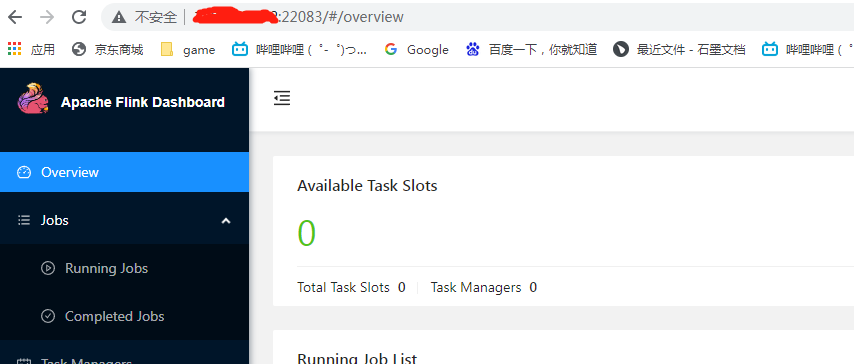

## 1、准备好一个k8s集群


## 2、配置好flink环境

2.1 Java环境配置

2.2 flink环境变量配置

## 3、启动flink集群

默认的账号default没有权限操作api server,需要为jobmanager创建一个ServiceAccount

```shell
kubectl create serviceaccount flink-service-account
kubectl create clusterrolebinding flink-role-binding-flink --clusterrole=edit --serviceaccount=default:flink-service-account
```

默认的service类型是LoadBalance，木有条件。NodePort官网上找不到指定端口的配置项，所以我改成了ClusterIP模式. 以及设置serviceAccount为刚创建的flink-service-account

```bash
kubernetes-session.sh -Dkubernetes.cluster-id=flink-session \
-Dkubernetes.rest-service.exposed.type=ClusterIP \
-Dkubernetes.service-account=flink-service-account
```

检查flink启动情况

```shell
[root@sz1 ~]# kubectl get [root@sz1 ~]# kubectl get pods
NAME                             READY   STATUS    RESTARTS   AGE
flink-session-6bddd6b4b6-cz5sc   1/1     Running   0          40s

[root@sz1 ~]# kubectl logs flink-session-6bddd6b4b6-cz5sc
sed: couldn't open temporary file /opt/flink/conf/sedrqmKu7: Read-only file system
sed: couldn't open temporary file /opt/flink/conf/sed62vnit: Read-only file system
/docker-entrypoint.sh: line 73: /opt/flink/conf/flink-conf.yaml: Read-only file system
/docker-entrypoint.sh: line 89: /opt/flink/conf/flink-conf.yaml.tmp: Read-only file system
Starting kubernetes-session as a console application on host flink-session-6bddd6b4b6-cz5sc.
2022-03-11 10:43:27,317 INFO  org.apache.flink.runtime.entrypoint.ClusterEntrypoint        [] - --------------------------------------------------------------------------------
2022-03-11 10:43:27,319 INFO  org.apache.flink.runtime.entrypoint.ClusterEntrypoint        [] -  Preconfiguration: 
2022-03-11 10:43:27,319 INFO  org.apache.flink.runtime.entrypoint.ClusterEntrypoint        [] - 
.
.
.
2022-03-11 10:43:31,706 INFO  org.apache.flink.runtime.rpc.akka.AkkaRpcService             [] - Starting RPC endpoint for org.apache.flink.runtime.resourcemanager.active.ActiveResourceManager at akka://flink/user/rpc/resourcemanager_1 .
2022-03-11 10:43:31,716 INFO  org.apache.flink.runtime.resourcemanager.active.ActiveResourceManager [] - Starting the resource manager.
2022-03-11 10:43:33,295 INFO  org.apache.flink.kubernetes.KubernetesResourceManagerDriver  [] - Recovered 0 pods from previous attempts, current attempt id is 1.
2022-03-11 10:43:33,296 INFO  org.apache.flink.runtime.resourcemanager.active.ActiveResourceManager [] - Recovered 0 workers from previous attempt.
```


## 4、设置端口转发访问web

因为是service是ClusterIP模式，所以要用port-forward给外面访问

```shell
kubectl port-forward svc/flink-session-rest 22083:22088 --address=0.0.0.0
```



运行flink程序

```bash
flink run \
    --target kubernetes-session \
    -Dkubernetes.cluster-id=flink-session \
    $FLINK_HOME/examples/table/WordCountSQLExample.jar
```


## 4、停止flink集群

官网上给了两种方式关掉集群，一种如下

```bash
echo 'stop' | kubernetes-session.sh -Dkubernetes.cluster-id=flink-session -Dexecution.attached=true
```

但是如果JobManager启动错误的话，是没有办法关掉的（可能是bug），这个时候可以选择第二种直接delete deployment即可

```shell
kubectl delete deployments/flink-session
```

