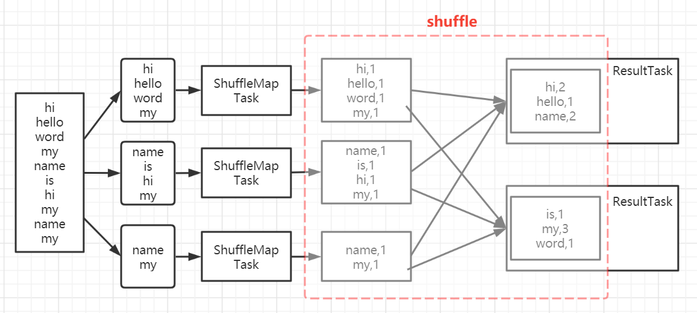
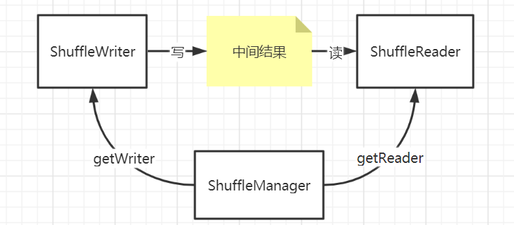
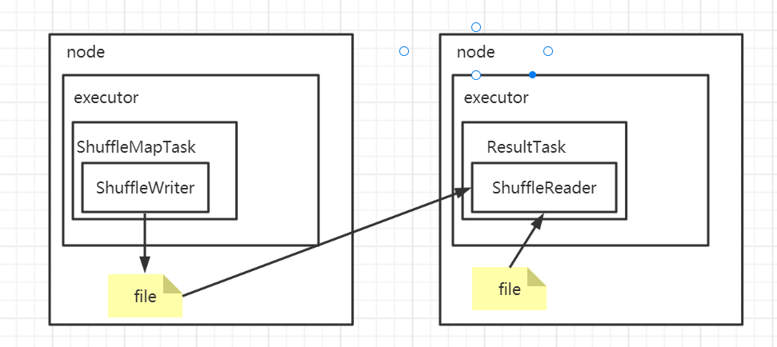
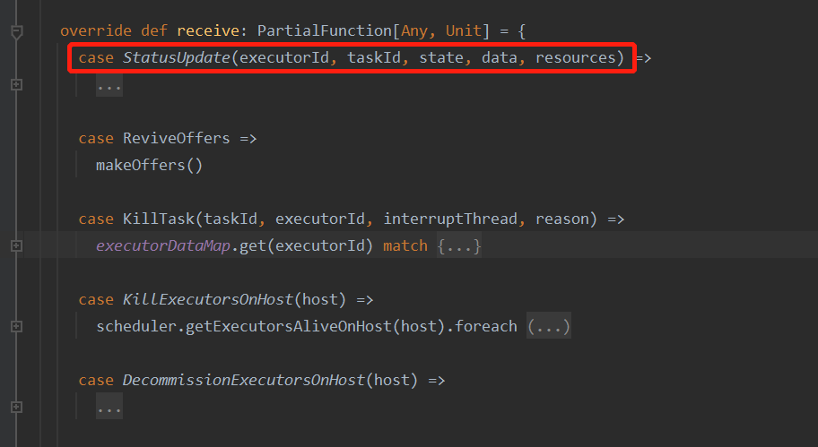

## 什么是shuffle

​	分布式计算框架的套路是将一个很大的数据集切割成多个小数据集放到不同的节点上并行计算，然后得到多个中间结果数据集。如果计算逻辑中含有汇总逻辑，就要将这些中间结果根据汇总条件打散到不同的节点再次处理。这个中间结果集打散然后被使用的过程就叫shuffle。如下图所示，有一个很大的文件要统计单词出现的次数。



​	

## ShuffleManager

在`Spark`中将`shuffle`这个过程抽象成两个动作，分别是写中间结果和读中间结果。考虑到有多种实现，又使用一个叫`ShuffleManager`的对象来统一管理写和读两个动作。当需要写中间结果时，通过`ShuffleManager.getWriter(....)`来获取一个`ShuffleWriter`对象来完成写操作。当需要读取中间结果时，通过`ShuffleManager.getReader(....)`来获取一个`ShuffleReader`来完成读操作。



ShuffleManager目前只有SortShuffleManager这么一个实现类


## ShuffleWriter

<font color="red"> TODO，增加小节 ：Writer工作原理 </font>


## External Shuffle Service

https://developer.aliyun.com/article/772329


之前有个朋友问我，如果没有发生跨节点传输数据，那还算shuffle吗？我个人理解：是否在不同的节点上并不是定义shuffle的必要条件，shuffle本质是两个无法合并两个stage之间的数据传输，全部在一个节点上是任务调度的关系，是shuffle中特殊的情况。	


​	


## shuffle的流程（待补充）




<font color="red"> TODO，增加小节 ：Reader工作原理 </font>

<font color="red"> TODO，增加小节 ：external shuffle service </font>

那么一个shuffle流程的流程是怎样的呢？为了方便描述，将前后两个ShuffleMapTask用MapReduce中的task类型类描述。前者称为MapTask，后者称为ReduceTask.  无论是Spark还是MapReduce计算框架，都是用了迭代器的方式去触发计算的。

1、MapTask逐行输出计算结果

2、计算结果写入缓存

3、缓存达到阈值，溢写磁盘形成一个小文件

4、重复1-3步骤，直到MapTask输出了全部计算结果，得到一堆小文件

5、利用归并排序算法对小文件进行合并，形成一个以分区id、分区key值排序的大文件


Spark内部把shuffl相关的功能抽象为writer以及reader，executor在执行task的时候，用writer输出数据，用reader读取数据。其底层实现被封装了起来。

这个writer以及reader是通过一个叫ShuffleManager获取的。ShuffleManager实现最初叫HashShuffleManager，后来被SortShuffleManager替代了。HashShuffleManager有两个阶段，分别是优化前，优化后两个阶段。优化前产生的文件数为 map任务数 * reduce任务数个临时文件，优化后为executor 个数 * reduce任务数。<font color="red">SortShuffleManager顾名思义，增加了排序的逻辑，在map端溢写时排序，合并成大文件时会排序,reduce端拉取数据的时候与map端使用同一个数据结构ExternalSorter，因此也会有溢写磁盘以及排序的逻辑。</font>

reader封装了从拉取数据的逻辑，reduce任务只需要考虑对数据集中每条数据如何处理即可。Spark用迭代器来表示一个数据集，reduce任务的实现就是通过遍历迭代器获取每一条记录，然后对记录进行处理。简化后的代码效果大致如下：

```
iterator = rdd.iteator(partitionId)
While iterator.hasNext():
    record = iterator.next()
    process(record)
```

process就是我们编写的业务逻辑处理函数，从不同的executor上拉取map任务输出的中间结果、然后排序合并等等的逻辑都隐藏在 迭代器的  next方法中。


reader在读取数据的时候，需要知道自己需要取的数据落在哪个executor上，因此会先通过MapOutPutTrackerWorker发送rpc请求给到 Driver中的MapOutPutTrackerMaster获取MapStatus对象。 MapStatus对象记录了Map任务的状态信息，这些信息包含了 数据存储所在的executor id，数据文件中各个partition的偏移量。


### MapOutPutTracker


MapTask任务完成时，会通过RPC向Drvier的MapOutPutTrackerMaster发送一个MapStatus对象


### 溢写

shuffle过程中，当map task输出数据满足以下条件时，会溢写到磁盘中：

（1）buffer或者map无法扩容时

（2）buffer或者map中的记录数达到阈值时，默认阈值为Integer.Max_value,即2的31次方。该值可以通过配置项修改


在sortShuffleWriter中可以看到map端的数据一定会落盘。


在spark 2.x中，map与reduce之间连接都是 all to all的，在spark 3.x中增加了 external shuffle service实现，优化了shuffle。


MapTask结束的时候，会通过rpc将task的状态信息发送给Driver。Spark的RPC并没有像Hadoop、Flink那样定义了一个接口协议，而是用scala的模式匹配来实现的。client直接new一个case class对象作为rpc请求的参数，server端代根据对象调用不同的方法处理。以下是DrvierEndpoint的代码




### Spark RPC

https://zhuanlan.zhihu.com/p/28893155

https://blog.csdn.net/oTengYue/article/details/105558585

已经知道要使用spark rpc，代码的模板如下：

```scala
val rpcConf = new RpcConf()
val config = RpcEnvClientConfig(rpcConf, "hello-client")
val rpcEnv: RpcEnv = NettyRpcEnvFactory.create(config)
val endPointRef: RpcEndpointRef = rpcEnv.setupEndpointRef(RpcAddress("localhost", 52345), "hell-service")
val future: Future[String] = endPointRef.ask[String](SayHi("neo"))
future.onComplete {
    case scala.util.Success(value) => println(s"Got the result = $value")
    case scala.util.Failure(e) => println(s"Got error: $e")
}
Await.result(future, Duration.apply("30s"))
```

发送rpc请求时用的RpcEndpointRef对象，到底是一个什么东西？是通过动态代理生成的对象？  业务逻辑代码在哪里？rpc请求是怎么发送出去的？

与Netty有什么关系？如果让我们设计一个rpc框架，有什么启发？


endPointRef.ask方法中会创建一个RpcMessageBox对象，然后

```scala
message.sendWith(receiver.client)
```

这个receiver就是前面得到的RpcEndpointRef，在RpcEndpointRef中会使用NettyRpcEnv


整个Spark RPC框架可以看做如下 （待完善）

一个JVM中只有一个RpcEnv，对应scala中的actorSystem，可以在看做负责一片区域的邮差，所有的邮件的收发都是经过这个邮差来实现的。

当你要与xx通信，你


