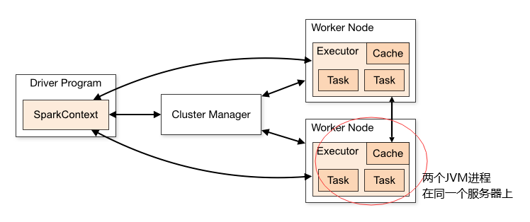
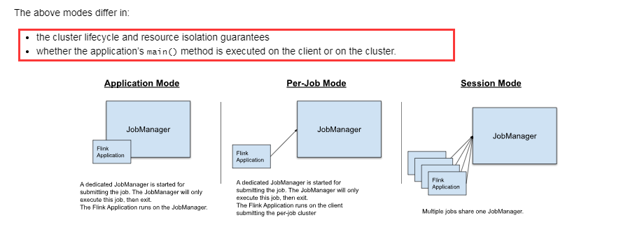
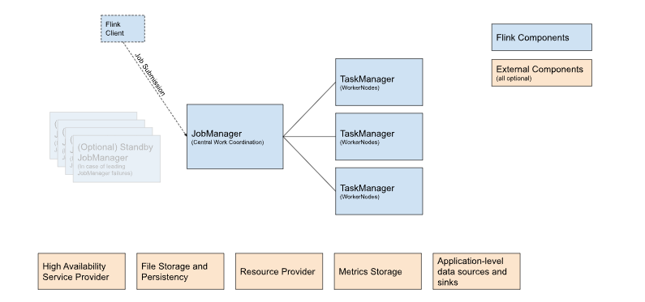
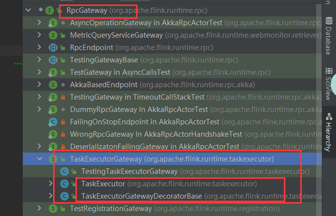
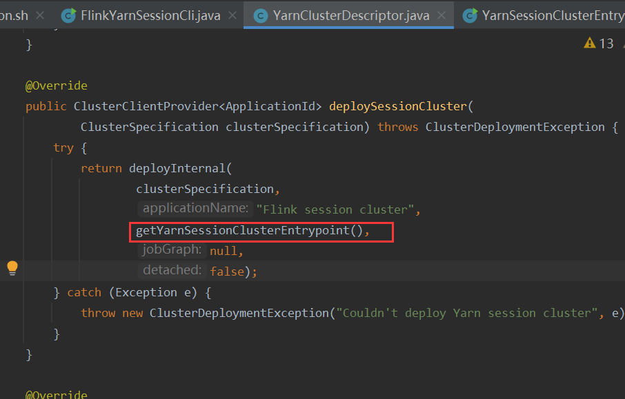
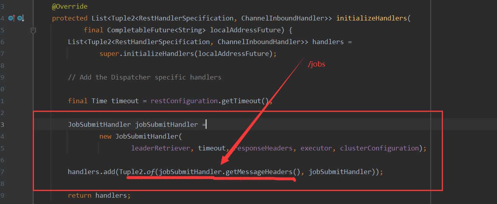
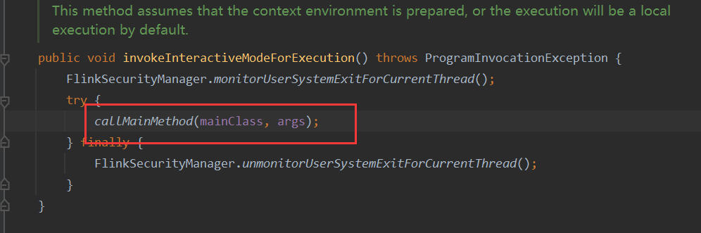
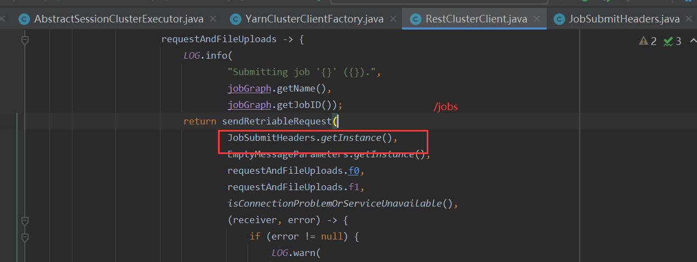
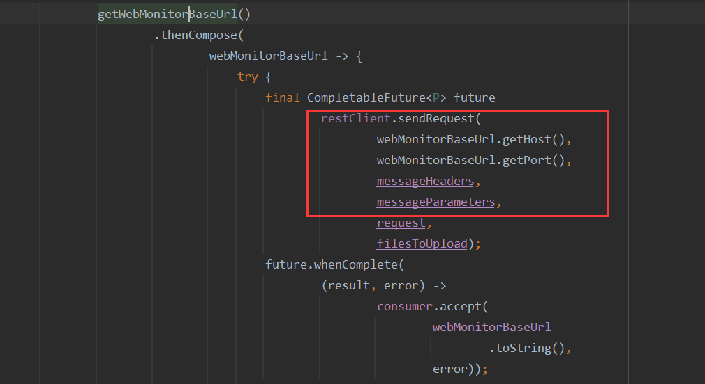

## Flink应用运行模式

在不同部署模式下，Flink应用和Spark应用运行模式并不相同。


Spark支持4部署模式（资源管理器）和2种运行模式。部署方式分别是standalone、mesos、k8s、yarn；运行方式有2种，分别是client模式以及cluster模式。

部署模式和运行模式的关系是组合关系，也就有4*2=8种情况。



Flink有3种部署模式和3种运行模式。部署方式分别是standalone、k8s、yarn， 不支持mesos是因为mesos已经很少人用了；运行模式分别是PerJob模式、Session模式、Application模式。



官方说明地址： https://nightlies.apache.org/flink/flink-docs-release-1.14/docs/deployment/overview/#per-job-mode

根据前面提到的组合关系，理论上flink有3*3=9种情况，但是standlone、k8s模式下，并不支持perjob模式，因此是7种。


因为flink对运行模式的称呼与spark的不一样，对于spark用户在学习flink的时候，很容易搞混。以官网的flink应用架构图来说明



在Spark用户看来，这是对应的Spark里面的standalone集群。flink client很自然对应spark-submit命令，jobmanager对应master,taskManager对应worker。但是在flink的standalone的session模式来说，jobmanager实现了spark standalone中master的资源请求处理、以及Driver主控应用的作用，taskManager实现了worker分配资源以及executor执行计算任务的作用。 而Spark无论哪种情况下，driver与master、executor与worker都是不同的JVM进程，都是独立分开的。


## RPC实现

要理解Flink的源码，需要了解flink各个进程之间是如何通讯的。flink的RPC与Spark相似，用netty仿制akka的api实现rpc的基础类，所有组件的通讯都是通过继承rpc的基础类来实现的。
主要的几个基础类如下： RpcService、RpcGateWay、RpcEndPoint、RpcServer。

***RpcGateWay以及RpcEndPoint***的关系可以从他们的类继承体系可以看出来。TaskExecutor是rpc中的被调用端，具体的逻辑实现方，是server端被调用方法具体实现；TaskExecutorGatewayDecoratorBase是请求发起方，是client端封装请求的实现；那么TaskExecutorGateway就相当于他们之间的通讯协议，也就是规定server以及client有哪些远程调用方法。




<font color="red">***RpcServer*** 、RpcService 需要了解一下akka框架后再补充</font>

akka框架采用的是消息传递模型，每个功能组件作为一个actor，actor之间通过互相传递消息推动所有事务（指集群的各个功能），单个actor内串行处理收到的消息。


## Flink Job提交流程（YarnSession模式）

使用下面的命令会创建一个YarnSession集群

```
yarn-session.sh -d
```

查看脚本可以看到对应的入口类`FlinkYarnSessionCli`.在入口类中会创建`yarnClient`然后与Yarn交互创建AM。AM的入口类就是`YarnSessionClusterEntrypoint`。



`YarnSessionClusterEntrypoint` 启动会创建一个叫webMonitorEndpoint的组件，该类继承了`RestServerEndpoint`类。调用其start()方法会启动一个netty server用于处理各种HTTP请求，<font color="red">包括Job的提交</font>.  webMonitorEndpoint的实现类有两个，分别是`MiniDispatcherRestEndpoint `以及 `DispatcherRestEndpoint`，前者对应的是PerJob模式，后者对应的是Session模式。

 `DispatcherRestEndpoint`重写了initializeHandlers方法，添加了JobSubmitHandler。JobSubmitHandler就是负责处理提交Job的请求的。<font color="red">webMonitorEndpoint启动时，会注册URL以及对应的handler，如图所示 /jobs，在后面看flink run命令提交job时也是这个 /jobs</font>



当我们用`flink run xxxx`提交flink程序的时候, 从flink.sh脚本可以看到入口类是`CliFrontend`。CliFrontend中会通过反射调用我们编写的main方法。



main方法中会调用env.execute()方法生成jobGraph，然后通过RestClusterClient （YarnSession模式是这个，其他的没看）将jar包还有jobGraph 发送给前面启动好的netty server处，而请求的地址就是 /jobs





