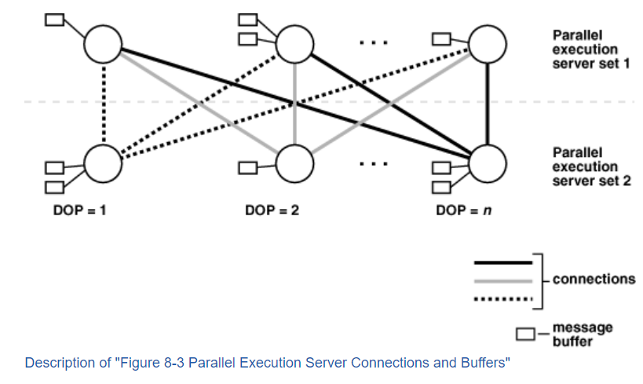

## Oracle并行SQL执行说明

#### day1

官方说明文档`https://docs.oracle.com/cd/E11882_01/server.112/e25523/parallel002.htm`

每一个SQL在解析的时候会经历优化以及并行化的解析，如果该SQL能够并行执行（执行计划可以看出来），会经历以下步骤：

1. 会话对应的server进程作为查询协调者
2. 查询协调者会申请请求数量的server进程来执行并行操作
3. SQL会转换成一系列的操作（例如 扫表、join、排序等等），每一个操作如果能够并行执行，oracle都会并行执行它们
4. 当并行操作完成后，协调者会执行那些不能并行执行的操作，以sum()操作为例，协调者会将并行Server进程的sum()结果取回来做sum()操作。
5. 协调者将最终结果返回给客户端。

上面只是很笼统的一个说明，有很多地方没有说清楚例如:

- 并行度是如何决定的
- 哪条数据属于哪个并行任务的
- 并行任务间的数据是怎么同步的

#### day2

已知执行并行SQL是通过多个Server进程实现，在官方文档的某小节中`How Parallel Execution Servers Communicate`中有一些描述

- 除了作为协调者的Server进程，其余Server进程还会分为producer Server 以及 consumer进程。producer Server对应图中server set1，其负责读取数据consumer server负责执行具体的数据处理（join 、sort 、dml、ddl等）

- 每一个producer server会与每一个consumer server 建立一个connection, 如图中所示，形成一个笛卡尔积的效果。图中并没有将协调者 画出来，每一个parallel execution servers (   producer server  +   consumer server ) 都会与 协调者 建立一个virtual connection.（  这里写虚拟连接 估计是因为  在单实例情况下，server与server之间是基于 shared pool中的 buffer进行通信的）

- 每一个connection 都会分配 1到4 个 buffer 用于通信， 单实例情况下 ，最多3个buffer；rac情况下，最多4个buffer.

  

- 

 
