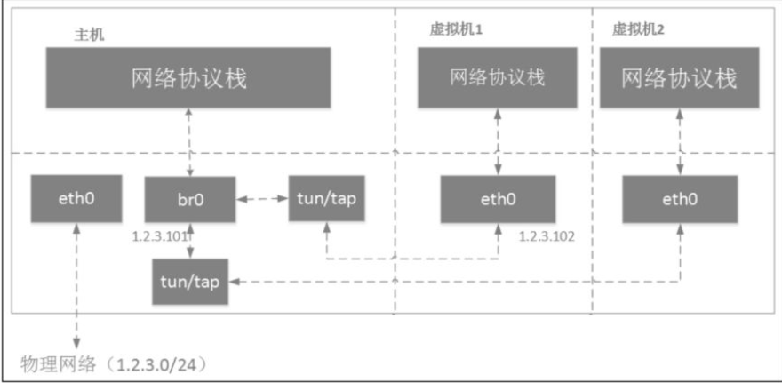
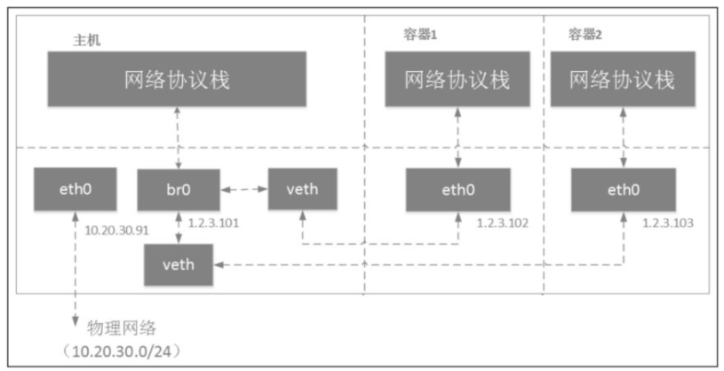
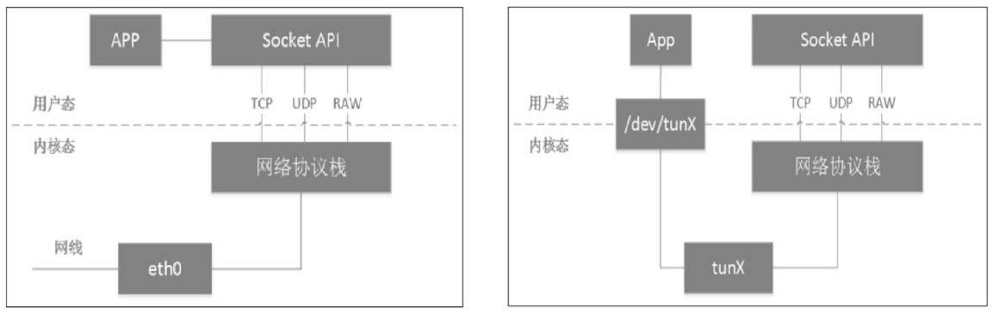
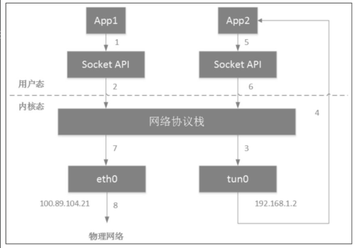

# 1、容器网络


## 1.1 namespace

> Linux的namespace（名字空间）的作用就是“隔离内核资源”。在Linux的世界里，文件系统挂载点、主机名、POSIX进程间通信消息队列、进程PID数字空间、IP地址、user ID数字空间等全局系统资源被namespace分割，装到一个个抽象的独立空间里。而隔离上述系统资源的namespace分别是Mount namespace、UTS namespace、IPC namespace、PIDnamespace、network namespace和user namespace

上述面文字摘抄自《Kubernetes网络权威指南》，namespace是linux虚拟化技术的基石。linux在创建进程的时候可以直接指定该进程的namespace。目前可指定的namespace 有上述文字描述的6种。


docker 本质上是一个指定了各种namespace的进程。默认情况下会为其分配一个属于该容器的Network Namespace，使其与其他容器、宿主机隔离，也可以在创建容器的时候，使用`–net=host`参数直接使用宿主机的网络栈（即宿主机的network namespace，普通的进程就是与宿主机使用相同的network namespace）。示例如下：

```shell
# nginx容器直接监听的就是宿主机的 80 端口。
docker run –d –net=host --name nginx-host nginx
```


关于network namespace相关的命令

```shell
# 查看network namespace
ip netns list

# 创建network namespace
ip netns add netns1

# 删除network namespace (只要仍旧有进程使用,该ns仍旧存在)
ip netns delete netns1

# 进入netns1这个network namespace查询网卡信息的命令
ip netns exec netns1 ip link list
```


## 1.2 veth pair

veth是虚拟以太网卡（Virtual Ethernet）的缩写。veth设备总是成对的，又称为veth pair。veth pair一端发送的数据会在另外一端接收。根据这一特性，veth pair常被用于跨networknamespace之间的通信，即分别将veth pair的两端放在不同的namespace里，即可使不同namespace间的进程可以通信了。

仅有veth pair设备，容器是无法访问外部网络的。为什么呢？因为从容器发出的数据包，实际上是直接进了veth pair设备的协议栈。如果容器需要访问网络，则需要使用网桥等技术将veth pair设备接收的数据包通过某种方式转发出去。


**veth pari 创建和使用的例子**

```shell
# 创建veth pair 分别是 veth0、veth1
ip link add veth0 type veth peer name veth1
```

然后用`ip link` 查看创建出来的veth, 初始状态是down

```shell
6: veth1@veth0: <BROADCAST,MULTICAST,M-DOWN> mtu 1500 qdisc noop state DOWN mode DEFAULT group default qlen 1000
    link/ether 0e:e7:43:99:a0:fe brd ff:ff:ff:ff:ff:ff
7: veth0@veth1: <BROADCAST,MULTICAST,M-DOWN> mtu 1500 qdisc noop state DOWN mode DEFAULT group default qlen 1000
    link/ether 66:d0:66:86:02:61 brd ff:ff:ff:ff:ff:ff
```

用ip link命令将这两块网卡的状态设置为UP

```shell
ip link set dev veth0 up
ip link set dev veth1 up
```

设置IP

```shell
ifconfig veth0 10.20.30.40/24
ifconfig veth0 10.20.30.41/24
```

将veth1放到某个network namespace中, 加入netns1后，状态会变回down,需要重新设置ip

```
ip link set veth1 netns netns1
```


## 1.3 bridge

veth pair只能让两个namespace通信，多个namespace通信就不行了。需要使用bridge（网桥）。计算机网络课本上的网桥是一个两层的网络设备，利用ARP协议根据mac地址将数据包转发到连接到它身上的不同局域网，后来被三层的交换机淘汰了。

Linux系统中的bridge的行为更像是一台虚拟的网络交换机，任意的真实物理设备（例如eth0）和虚拟设备（例如，veth pair、tap设备）都可以连接到Linux bridge上。连接到bridge的设备其mac地址以及ip地址就没有用了，因为这些设备被当成一个端口使用了，它们接受到的所有数据包都会交给bridge来处理。

**网桥在虚拟机中的应用**




图片取自《Kubernetes网络权威指南》。访问外网的时候，tun/tap会将虚拟机网卡eth0的数据包给到br0网桥，然后br0网桥会将包从eth0送出去，不经过宿主机的网络协议栈。


**网桥在容器中的应用**



图片取自《Kubernetes网络权威指南》。这里容器用的veth pair，数据包同样会给到br0，然后经由eth0送出去，不经过宿主机的网络协议栈。


**混杂模式**

IEEE 802定的网络规范中，每个网络帧都有一个目的MAC地址。在非混杂模式下，网卡只会接收目的MAC地址是它自己的单播帧，以及多播及广播帧；在混杂模式下，网卡会接收经过它的所有帧。

```shell
# 查看一个网卡是否开启了混杂模式,当输出包含 PROMISC 时，表明该网络接口处于混杂模式。
ifconfig eth0

# 开启混杂模式
ifconfig eth0 promisc

# 退出混杂模式
ifconfig eth0 -promisc

```

将网络设备加入Linux bridge后，会自动进入混杂模式。


网桥相关的一些命令：

```shell
# 创建网桥
ip link add name br0 type bridge
ip link set br0 up 

# 将veth0 连接到br0上
ip link set dev veth0 master br0

# 查看网桥上有哪些设备
bridge link
```

还可以使用brctl命令操作

```shell
# 安装相关rpm
yum install bridge-utils

# 创建网桥
brctl addbr br0

# 将veth0 连接到br0上
brctl addif br0 veth0

# 查看网桥上有哪些设备
brctl show
```


## 1.4 tap/tun

tap / tun 与veth这些一样也是虚拟设备，可以与socket对比看会更好理解。



上两图截取自《Kubernetes网络权威指南》。

左边的图表示的是物理网卡从网线接收数据后送达网络协议栈，而进程通过Socket创建特殊套接字，从网络协议栈读取数据。

右边的图是tun设备的工作原理图。 从网络协议栈的角度看，tun/tap设备这类虚拟网卡与物理网卡并无区别。只是对tun/tap设备而言，它与物理网卡的不同表现在它的数据源不是物理链路，而是来自用户态。

tap与tun的区别是，tun工作在第三层，根据ip转发，tap工作在第二层，根据mac转发。


**下面是VPN的工作原理**



下面描述文字的序号并不等于图中的序号。app2是vpn软件，安装软件会创建一个tun设备，并在路由表中添加一条路由，凡是访问192.168.1.0网段的都有tun0转发出去。tun0一端连着网络协议，另一端连着app2.所以所有流到tun0的网络包都会给到app2处理。vpn数据发送出去的流程如下：

（1）现在app1想要通过vpn访问另一端的服务器，例如192.168.1.4。app1通过socket api向网络栈发出一个目标地址是192.168.1.4的包

（2）经过路由，交由tun0。因此tun另一端的app2收到了app1发往192.168.1.4的数据包。

（3）App2会将该数据包进行加密、压缩等操作然后通过socket api向网络栈发出一个通往vpn server的数据包（server的ip地址往往是公网IP或者网关这种能够被vpn 两端访问到的地址）。

（4） 最终查路由表 将 app2 发出的数据包 交由连接外部网络的网卡 eth0 发出。数据包到了server后，由Server重新封装数据包转发给192.168.1.4所在的服务器。

（5）数据包到达目标服务器后，经过网络协议栈，app2加密的数据包到了tun设备后交给 vpn解析后又 经过 协议栈 给到目标程序


