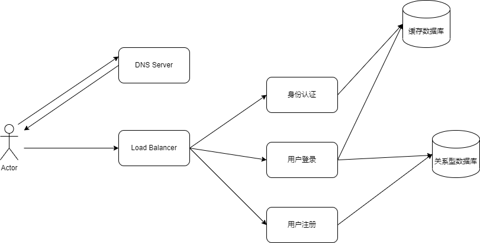

# 如何设计高可用架构

首先，在谈这个问题时候我们需要知道，所有工程设计都是有成本的，因此什么需要去保障，什么需要妥协，需要评估和分析。

FMEA(Failure mode and effects analysis，故障模式与影响分析)的方法是用于可用性分析的方法论，通过按照严重程度进行分类，以确认失效对系统的最终影响。
主要步骤：
- 给出系统架构设计图
- 基于架构设计图，确认某个部件或功能发生故障锁产生的影响范围。
- 根据故障影响评估严重程度。
- 总结发生故障的原因，并确定发生故障的概率。
- 根据严重程度和发生概率确定风险程度。
- 根据风险程度确定防御措施和实施成本。

以一个用户中心系统为例，用户中心系统主要包括以下功能：
- 用户注册
- 用户登录退出
- 用户身份认证

首先，各功能点确认对业务不是同样重要的，在这里用户注册相对用户登录和用户身份认证要低一些，因为用户注册影响的用户要明显少于用户登录和用户的身份认证。按照业务重要程度：用户身份认证 > 用户登录退出 > 用户注册。

下面是一个简单的系统设计图：

| 功能点 | 故障模式 | 故障影响 | 严重程度 |  故障原因 | 故障概率 | 故障风险 | 防范措施 | 实施成本 |
|:-------|:--------|:----------|:----------|:---------|:--------|:--------|:--------|:----------|
| 用户身份认证 | DNS故障 | 用户无法使用网站 | 高 | 人为修改错误 | 中 | 高     | 增加域名修改规范和流程 | 低 |
| 用户身份认证 | LB故障 | 用户无法使用网站 | 高 | 负载均衡器宕机 | 中 | 高    | 增加多个负载均衡服务 | 低 |
| 用户身份认证 | LB故障 | 用户无法使用网站 | 高 | 机房网络线路故障 | 低 | 中    | 增加同城异区多机房 | 高 |
| 用户身份认证 | 缓存服务器无法访问 | 用户无法使用网站 | 高 | 缓存服务器宕机 | 中 | 高    | 开启主从模式，让缓存服务器高可用 | 中 |
| 用户登录 | 关系型数据库无法访问 | 用户无法登录 | 中 | 关系型数据库宕机 | 中 | 中    | 开启主从模式，让关系型数据库高可用 | 中 |
| 用户登录 | 关系型数据库访问超时 | 部分用户无法登录 | 低 | 关系型数据库存在慢查询 | 高 | 中  | 开启慢查询日志，优化慢查询 | 低 |
| 用户注册 | 关系型数据库无法访问 | 用户无法注册 | 低 | 关系型数据库主库宕机 | 中 | 中    | 开启多主切换，让关系型数据库高可用 | 高 |

通过 FMEA 表格我们可以看出当前系统设计存在的故障风险点和故障实施措施的成本，基于故障风险和实施成本可以列出后续执行计划和优先级。