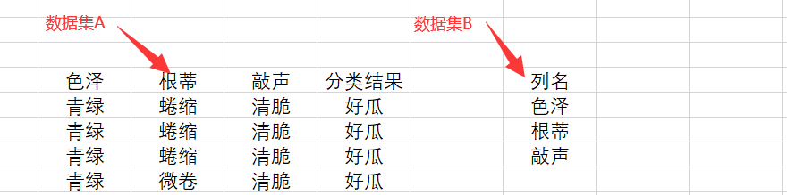
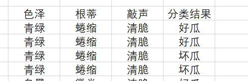
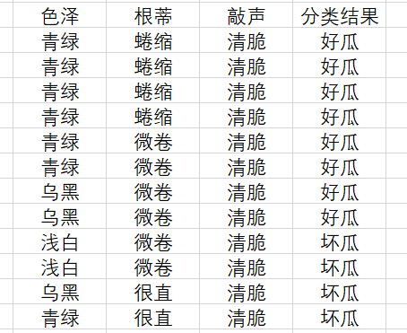
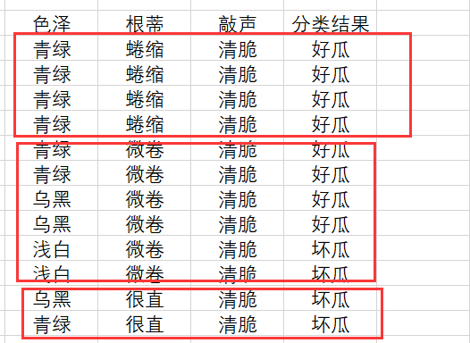
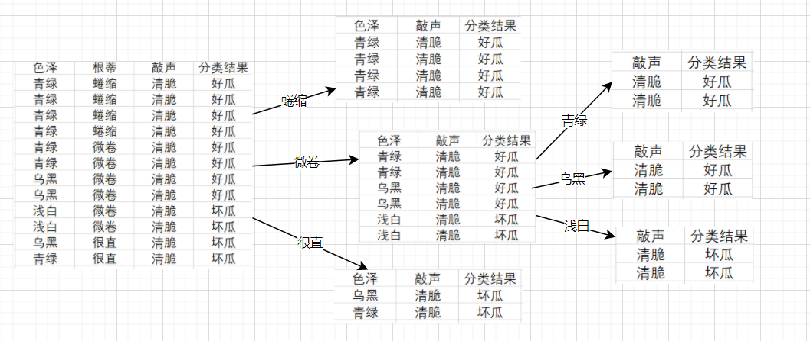
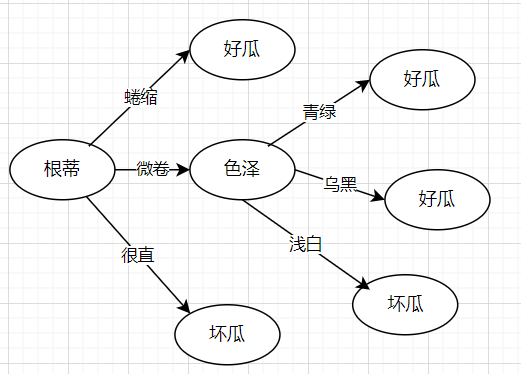
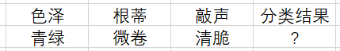
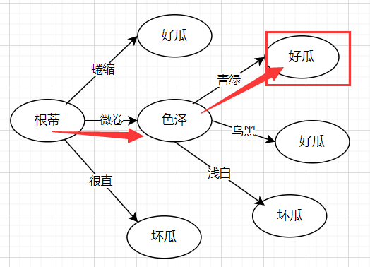
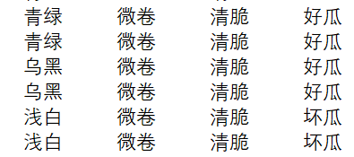
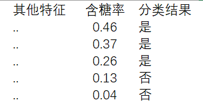

机器学习


## 第4章 决策树

### 4.1简介

决策树是一类常见的有监督机器学习算法。其学习过程简单且直观。

决策树的工作原理和我们思考问题时候大脑的回路相似。例如有一个西瓜，我们判断这是一个好瓜的流程如下：

1、颜色是否是青绿色？如果是继续看，否则是不好的瓜

2、根蒂是什么形态的？如果是蜷缩状的继续看，否则是不好的瓜

3、敲起来是什么声音？如果是“嗵嗵”声则是好瓜，否是不好的瓜

在上面用于决策的答案，例如是否青绿色、是否是蜷缩状等等是我们通过大量的吃瓜经验得到的。决策树算法也能通过使用优质数据训练得到。


### 4.2 算法大致流程

想要知道决策树是如何工作的就要了解决策树是如何构成的以及如何预测的。

#### 4.2.1建树流程

构成树的时候，根据划分分支的策略以及处理的不同，又称为不同的决策树算法。目前常见的算法有ID3、C4.5以及CART树这三种。下面说明算法流程的是以ID3算法为例子进行说明。构建过程是一个递归的过程，大概如下：

（1）构建数据集A，B。大致如下



<center>图4.1</center>

（2）创建一个节点node

（3）检查数据集A中的类别是否一致，如果一致则，假设如图4.1，所有数据都属于类别 “好瓜“，则将根结点标记为好瓜，构建结束。

（4）数据集A中类别不一致，检查能否通过B中包含的特征列去对A的类别进行划分

（4.1）假设数据如图4.2所示，不能划分，则将根节点标记为A1，构建结束。



<center>图4.2</center>

（4.2）能划分，则进行步骤（5）

（5）假设数据如图4.3，根据划分策略（ID3算法）计算信息增益（信息增益计算请看4.3.1小节），结果根蒂的信息增益最大，因此 选择“ 根蒂 ”这个特征作为该节点的划分依据。如果有做预剪枝，则还会判断划分前后的泛化性能是否有提升，如果有提升就会进行第（6）步操作，否则直接将当前结点标记为叶子节点。



<center>图4.3</center>

（6）对该特征的值进行去重，然后根据特征值对图4.3中的数据集进行划分，本次迭代选取了根蒂这个特征作为划分，因此根蒂属性值总共有3个，分别是

蜷缩、微卷、很直。数据集也会划分成3份。



（7）然后对每一份数据集执行（1）~（6）步骤创建树的节点，新建的节点作为子节点加入到树中。

（8）完成键树

为了能够更加形象地描述数据处理过程，下面是数据集在迭代中划分的变化



下面是树构建完成后的样子




#### 4.2.2 预测流程

预测的过程其实就是一个查找树的过程。举个例子现在有一个西瓜，我们得到这个西瓜的信息如下



预测过程如下



### 4.3划分选择

决策树与一般的IF ELSE的区别在于建树流程的第（5）步，即挑选哪一个特征划分分支。一般而言，随着划分的过程的不断进行，我们希望决策树的分支结点所包含的样本尽可能属于同一类别，即结点的“纯度”越来越高。

#### 4.3.1信息增益

<font color="red">ID3决策树算法（4.2中举的例子）会挑选信息增益最大的特征来划分分支。</font>要了解信息增益就要先了解信息熵。信息熵是度量样本集合的"纯度"最常用的一种指标。当信息熵的值越小，数据集中所包含的信息量越小，即类别越小。假定当前样本集合D，则D的信息熵为
$$
Ent(D)= - \sum_{k=1}^aP_klog_2P_k
$$
公式中的字符说明如下:

```
a：表示数据集D中有a个类别
k: 表示第几类
P：下标k,表示第几类的概率也就是占比
```

信息增益就是利用划分前以及划分后的数据集的信息熵计算得到的，公式如下
$$
Gain(D,s)=Ent(D)-\sum_{k=1}^{a}{{|D^k|}\over|D|}Ent(D^k)
$$
公式中的字符说明如下

```
s: 表示计算得到的信息增益值是选定特征s后计算得到的
a：表示特征s中有a个可能值
k: 表示a个值中的第几个值
Dk/D: 表示第K个值的样本数占整个数据集D样本数的比例值
Ent(Dk)： 表示信息特征s取值为第k个值的数据集的信息熵
```


举个例子，以4.2的数据集来计算一下特征根蒂的信息增益值。

**数据集D的信息熵：**

数据集D共有12个样本，只有好瓜以及坏瓜两类，因此a=2。好瓜占8个，坏瓜占4个，因此类别为好瓜的概率为2/3, 类别为坏瓜的概率为 1/3
$$
Ent(D)= - \sum_{k=1}^2P_klog_2P_k=-({2\over3}log_2{2\over3}+{1\over3}log_2{1\over3})=0.92
$$
**特征“根蒂”的信息增益为**

数据集D样本数12，  根蒂的值共有3个分别为蜷缩、微卷、很直。值为蜷缩的样本共有4个，占比为1/3
$$
Ent(D^{蜷缩})=-{1\over3}log_2{1\over3}=0.52
$$
同理计算另外两个值的得到 微卷的熵为 0.92，很直的熵为0.43。因此**选择特征根蒂的信息增益为**
$$
Gain(D,根蒂)=Ent(D)-\sum_{k=1}^{3}{{|D^k|}\over|D|}Ent(D^k)=0.92-({1\over3}*0.52+{1\over2}*0.92+{1\over3}*0.43)=0.14
$$

#### 4.3.2增益率

ID3决策树算法基于信息增益来做分支划，存在偏向多属性值的特征的问题。原因是建树流程中会根据特征值对数据集进行划分，如果值特别多，划分的数据集就变成很多，每个集合的数据量就会少，极端情况下，一个数据集中只有一行数据。此时计算得到的信息熵为最小，因为只有一个类别。划分后信息熵最小，代入信息增益的式子中就会得到最大的信息增益。

为了解决这个问题，C4.5决策树算法中，采用增益率来作为划分分支的指标。

增益率的公式如下：
$$
Gain\_ratio(D,a)={Gain(D,a) \over IV(a)}
$$
其中
$$
IV=-\sum_{k=1}^a{{|D^k|} \over |D|}log_2{{|D^k|} \over |D|}
$$
<font color="red">增益率其实就是将信息增益的式子除以一个随着特征值增多而增大的式子，从而避免挑选特征时偏向值较多的特征。</font>虽然解决了偏向值较多的特征的问题，但变成了偏向值较少的特征，因此C4.5并不是直接使用增益率来划分，而是从信息增益超过平均水平的特征中取增益率最大的特征作为划分特征。


#### 4.3.3基尼指数

CART树采用的是基尼指数来选择划分特征。基尼指数是在基尼值上计算得到的。基尼值也是用来衡量数据集的纯度的一种指标，其计算公式如下：
$$
Gini(D)=\sum_{k=1}^a\sum_{k^`\neq k}p_kp_{k`}=1-\sum_{k=1}^{|a|}p_k^2
$$
基尼指的计算公式如下
$$
Gini\_index(D,a)=\sum_{k=1}^a{ {|D^k|}\over{|D|}}Gini(D^k)
$$


基尼指数的值越小表示纯度越高，因此CART树会选择基尼指数最小的特征作为划分特征。


### 4.4剪枝

正如前面增益率中提到的极端情况下，决策树会发生过拟合的情况。剪枝是决策树学习算法用来对付“过拟合”的主要手段。<font color="red">剪枝又分为预剪枝以及后剪枝.，两者都是通过判断分支前后模型的泛化性能是否有提升来进行剪枝的。</font>


#### 4.4.1如何判断泛化性能有提升

所谓的模型的泛化性其实就是模型对不同的数据的分类或者预测效果，这里用分类的准确率来表示。


以图中的 色泽这个结点来举例子，色泽这个结点对应的数据集（从树的路径来看，根蒂的值为微卷已经确定）如下




共有样本数为6，如果不划分分支，该节点以类别样本最多的类别作为该结点的标签，因此统一分类为好瓜。准确率为67%.

如果划分分支，准确率为100%，100%>67% 因此准确率提高了，所以该节点允许继续划分。

#### 4.4.2预剪枝

预剪枝是在决策树构建的过程中，对每个结点在划分前先进行评估。若当前结点的划分不能带来泛化性能上的提升，则停止划分，并将当前结点标记为叶子节点。

预分支的剪枝判断顺序是 根蒂->色泽

#### 4.4.3后剪枝

是在决策树构建完成后，自底向上对树进行裁剪。裁剪的过程就是判断未分支前以及分支后的泛化性能是否有所提升。若当前结点的划分不能带来提升，则将分支联系断开，当前结点标记为叶子结点。后剪枝的判断顺序是  色泽 -> 根蒂。

#### 4.4.4两种剪枝技术的选择

后剪枝比预剪枝保留了更多的分支。一般情况下，后剪枝欠拟合的风险较小，泛化性能优于预剪枝。因为预剪枝是自上而下只比较了上层的节点，得到的是局部最优，而后剪枝是自下而上，比较了所有的分支结点。因为后剪枝是在模型训练完成后做的，因此训练时间会比预剪枝要大很多。

### 4.5连续与缺失值的处理

#### 4.5.1 连续型值处理

前面的示例都是用离散型特征、离散型的目标值进行说明的，如果是连续型特征值、连续型的目标值，那么我们又该如何去划分分支以及如何衡量模型的泛化性呢？

C4.5算法中采用二分法从连续特征值中找到一个值t，当特征值不大于该t值的数据，为集合A，大于该t值的数据为集合B。

假设西瓜新增了一列含糖率作为特征。



那么在构建决策树的时候需要考虑两个问题

（1）


