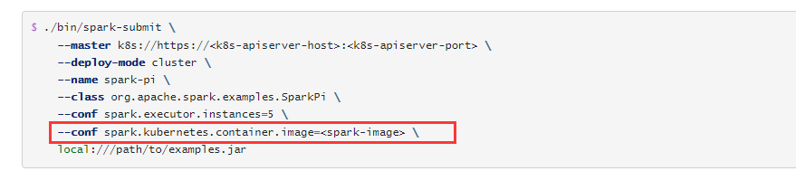
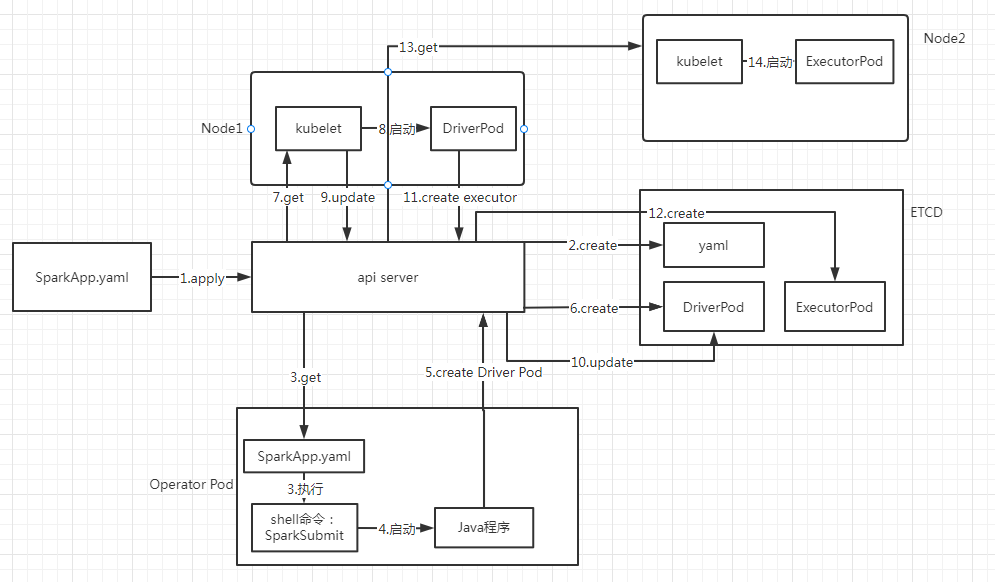

Spark On k8s

Spark支持k8s部署，但是运行spark命令和以前Yarn的一样，都是通过spark-submit脚本去提交，不同的是需要指定很多k8s的参数.

这种方式需要指定很多参数（k8s yaml文件中的kv）,很不直观和容易出错。google通过自定义Operator的方式，实现了以k8s风格（通过yaml）的方式提交Spark应用。Operator源码地址：

https://github.com/GoogleCloudPlatform/spark-on-k8s-operator

Operator原理

Spark应用启动流程如图中箭头序号所示，上图省略了很多逻辑，例如scheduler分配的逻辑、省略了driver、executor启动后更新状态的逻辑。

