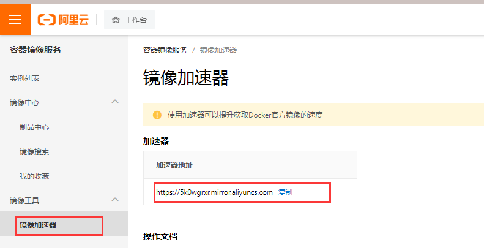
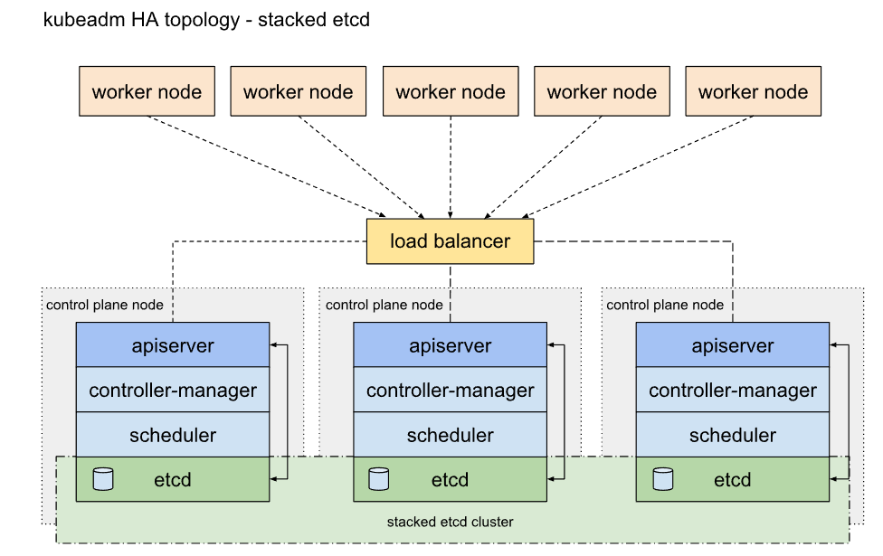

使用kubeadm安装集群，操作系统以centos7.9为例。

以下笔记内容参考k8s官方安装文档`https://kubernetes.io/zh/docs/setup/production-environment/tools/kubeadm/install-kubeadm/`


### 1、所有的节点上安装kubeadm以及docker

#### 1.1添加yum源

```bash
# cat << EOF的意思是以EOF输入字符为标准输入结束，就是当你输入cat << EOF的时候，你可以随意输入字符，但是当输入EOF的时候就结束了。
# 下面是将输入的内容输出到kubernetes.repo文件中
cat <<EOF > /etc/yum.repos.d/kubernetes.repo
[kubernetes]
name=Kubernetes
baseurl=https://mirrors.aliyun.com/kubernetes/yum/repos/kubernetes-el7-x86_64/
enabled=1
gpgcheck=1
repo_gpgcheck=1
gpgkey=https://mirrors.aliyun.com/kubernetes/yum/doc/yum-key.gpg https://mirrors.aliyun.com/kubernetes/yum/doc/rpm-package-key.gpg
exclude=kube*
EOF

# 将 SELinux 设置为 permissive 模式（相当于将其禁用）, 我这里直接设置为disable了
sudo setenforce 0
sudo sed -i 's/^SELINUX=enforcing$/SELINUX=permissive/' /etc/selinux/config

sudo yum install -y kubelet kubeadm kubectl --disableexcludes=kubernetes

# 设置开机启动
sudo systemctl enable --now kubelet
```


#### 1.2 其他操作

为了保证 kubelet 正常工作，**必须** 禁用交换分区 (<font color="red">只知道会降低性能，为何强制要关掉就不清楚了</font>)

```shell
swapoff -a
```

为了让你的 Linux 节点上的 iptables 能够正确地查看桥接流量 (<font color="red">不清楚这块知识</font>)

```shell
cat <<EOF | sudo tee /etc/modules-load.d/k8s.conf
br_netfilter
EOF

cat <<EOF | sudo tee /etc/sysctl.d/k8s.conf
net.bridge.bridge-nf-call-ip6tables = 1
net.bridge.bridge-nf-call-iptables = 1
EOF

sudo sysctl --system
```


#### 1.3 安装docker

安装前先卸载旧版本docker

```shell
yum remove docker docker-client docker-client-latest docker-common docker-latest docker-latest-logrotate docker-logrotate docker-engine
```

阿里云的安装教程 https://developer.aliyun.com/mirror/docker-ce?spm=a2c6h.13651102.0.0.53322f70ave0cL

```shell
# step 1: 安装必要的一些系统工具
sudo yum install -y yum-utils device-mapper-persistent-data lvm2
# Step 2: 添加软件源信息
sudo yum-config-manager --add-repo https://mirrors.aliyun.com/docker-ce/linux/centos/docker-ce.repo
# Step 3
sudo sed -i 's+download.docker.com+mirrors.aliyun.com/docker-ce+' /etc/yum.repos.d/docker-ce.repo
# Step 4: 更新并安装Docker-CE
sudo yum makecache fast
# 查看docker版本
yum list docker-ce --showduplicates | sort -r
# 安装指定版本
sudo yum -y install docker-ce-20.10.12-3.el7
# Step 4: 开启Docker服务
sudo systemctl start docker
# 开机启动
sudo systemctl enable docker
```

修改默认镜像仓库地址,  获取路径  登录阿里云官网  -> 容器镜像服务 -> 镜像工具 



```shell
sudo mkdir -p /etc/docker
sudo tee /etc/docker/daemon.json <<-'EOF'
{
  "registry-mirrors": ["https://5k0wgrxr.mirror.aliyuncs.com"]
}
EOF
sudo systemctl daemon-reload
sudo systemctl restart docker
```

### 2、修改kubeadm的默认参数（可选）

```shell
# 将默认参数保存到文件中
kubeadm config print init-defaults > init.default.yaml
```


### 3、下载kubernetes的相关镜像

```shell
# 查看需要的镜像列表
kubeadm config images list

# 下载镜像,但是因为镜像默认是国外的仓库地址所以会失败
kubeadm config images pull
```

需要的镜像如下

```
k8s.gcr.io/kube-apiserver:v1.23.1
k8s.gcr.io/kube-controller-manager:v1.23.1
k8s.gcr.io/kube-scheduler:v1.23.1
k8s.gcr.io/kube-proxy:v1.23.1
k8s.gcr.io/pause:3.6
k8s.gcr.io/etcd:3.5.1-0
k8s.gcr.io/coredns/coredns:v1.8.6
```

因为是google的仓库，所以需要转换成国内的仓库,下面的shell脚本是从百度搜到，然后把版本号替换掉了

```
images=(  # 下面的镜像应该去除"k8s.gcr.io/"的前缀，版本换成上面获取到的版本
    kube-apiserver:v1.23.1
    kube-controller-manager:v1.23.1
    kube-scheduler:v1.23.1
    kube-proxy:v1.23.1
    pause:3.6
    etcd:3.5.1-0
    coredns:v1.8.6
)

for imageName in ${images[@]} ; do
    docker pull registry.cn-hangzhou.aliyuncs.com/google_containers/$imageName
    docker tag registry.cn-hangzhou.aliyuncs.com/google_containers/$imageName k8s.gcr.io/$imageName
    docker rmi registry.cn-hangzhou.aliyuncs.com/google_containers/$imageName
done
```

这里的coredns会在后续的检查中提示没有找到因为真正的地址如下


只需要重新打个tag即可

```sh
docker tag k8s.gcr.io/coredns:v1.8.6 k8s.gcr.io/coredns/coredns:v1.8.6
docker rmi k8s.gcr.io/coredns:v1.8.6
```

打完tag后如下

```shell
[root@sz1 kubeadm]# docker images
REPOSITORY                           TAG                 IMAGE ID            CREATED             SIZE
k8s.gcr.io/kube-apiserver            v1.23.1             b6d7abedde39        3 weeks ago         135 MB
k8s.gcr.io/kube-proxy                v1.23.1             b46c42588d51        3 weeks ago         112 MB
k8s.gcr.io/kube-controller-manager   v1.23.1             f51846a4fd28        3 weeks ago         125 MB
k8s.gcr.io/kube-scheduler            v1.23.1             71d575efe628        3 weeks ago         53.5 MB
k8s.gcr.io/etcd                      3.5.1-0             25f8c7f3da61        2 months ago        293 MB
k8s.gcr.io/coredns/coredns           v1.8.6              a4ca41631cc7        3 months ago        46.8 MB
k8s.gcr.io/pause                     3.6                 6270bb605e12        4 months ago        683 kB
```


### 4、使用kubeadm安装Master/worker

#### 4.1 初始化前预检查

```
kubeadm init phase preflight
```

看《Kubernetes权威指南》上，检查的项很多，但我执行命令只是列了几个项出来

#### 4.2 设置cgroup驱动

kubernetes默认设置cgroup驱动为“systemd”，而docker服务的cgroup驱动默认值为“cgroupfs”，官网上建议是与kubernetes保持一致的。修改docker的服务配置（默认为`/etc/docker/daemon.json`）

```json
{
 "exec-opts": ["native.cgroupdriver=systemd"]
 ....
}
```

<font color="red">修改完后重启docker服务</font>，然后用docker info检查cgroupfs是否已经设置为`systemd`。

如果报错了`specified both as a flag and in the configuration file: exec-opts`

查看systemctl start docker对应的命令``


然后发现启动命令中已经指定native.cgroupdriver为systemd了。<font color="red">所以还原`/etc/docker/daemon.json`即可</font>

#### 4.3  安装master

```shell
# 安装master
kubeadm init --pod-network-cidr=192.168.0.0/16
```

如图所示即master安装成功


kubeadm join是将其他节点加入集群时使用的命令需要保存好。如果忘记kubeadm join 可以通过如下命令重新获取join命令参数

```shell
# kubeadm token create --print-join-command
```

master装好后，还需要配置kubectl访问k8s

```shell
# root用户
vim ~/.bashrc
# 添加一下环境变量指定kubectl 连接集群时使用的配置文件
export KUBECONFIG=/etc/kubernetes/admin.conf
source ~/.bashrc

# 非root用户
mkdir -p $HOME/.kube
sudo cp -i /etc/kubernetes/admin.conf $HOME/.kube/config
sudo chown $(id -u):$(id -g) $HOME/.kube/config
```

最后验证master是否安装成功

```shell
[root@sz1 kubernetes]# kubectl -n kube-system get configmap
NAME                                 DATA   AGE
coredns                              1      47h
extension-apiserver-authentication   6      47h
kube-proxy                           2      47h
kube-root-ca.crt                     1      47h
kubeadm-config                       1      47h
kubelet-config-1.23                  1      47h

```

#### 4.4 添加node

<font color="red">将1~3小节的操作在新加的node上重复一遍</font>,然后执行kubeadm init 时最后输出的join命令

```shell
kubeadm join xxx.xx.xx.xx:6443 --token jbelvz.he84sqhp6gpo8twf --discovery-token-ca-cert-hash sha256:99f6e14d7a287ee05f369ea79090b57f7e5bf437ca2b8d0b43afc38a6b35c695
```

控制台输出以下内容，表示已经添加成功

```shell
This node has joined the cluster:
* Certificate signing request was sent to apiserver and a response was received.
* The Kubelet was informed of the new secure connection details.

Run 'kubectl get nodes' on the control-plane to see this node join the cluster.
```

用`kubectl get nodes`查看node的状态

```
[root@sz1 ~]# kubectl get nodes
NAME   STATUS     ROLES                  AGE   VERSION
sz1    NotReady   control-plane,master   9h    v1.23.1
sz2    NotReady   <none>                 9h    v1.23.1
```

`NotReady`是因为还没有安装网络插件

#### 4.5 设置master也参与POD的调度（可选）

```sh
# 这里我的sz1是master，如果是HA方案存在多个master则可以将 sz1  换成 --all
kubectl taint nodes sz1 node-role.kubernetes.io/master-
```

#### 4.6、删除master/worker

可以运行`kubeadm reset`命令将主机恢复原状，重新运行`kubeadm init`命令再次进行安装。下面是运行`kubeadm reset`的输出

```shell
[root@sz1 ~]# kubeadm reset
[reset] Reading configuration from the cluster...
[reset] FYI: You can look at this config file with 'kubectl -n kube-system get cm kubeadm-config -o yaml'
[reset] WARNING: Changes made to this host by 'kubeadm init' or 'kubeadm join' will be reverted.
[reset] Are you sure you want to proceed? [y/N]: y
[preflight] Running pre-flight checks
[reset] Stopping the kubelet service
[reset] Unmounting mounted directories in "/var/lib/kubelet"
[reset] Deleting contents of config directories: [/etc/kubernetes/manifests /etc/kubernetes/pki]
[reset] Deleting files: [/etc/kubernetes/admin.conf /etc/kubernetes/kubelet.conf /etc/kubernetes/bootstrap-kubelet.conf /etc/kubernetes/controller-manager.conf /etc/kubernetes/scheduler.conf]
[reset] Deleting contents of stateful directories: [/var/lib/etcd /var/lib/kubelet /var/lib/dockershim /var/run/kubernetes /var/lib/cni]

The reset process does not clean CNI configuration. To do so, you must remove /etc/cni/net.d

The reset process does not reset or clean up iptables rules or IPVS tables.
If you wish to reset iptables, you must do so manually by using the "iptables" command.

If your cluster was setup to utilize IPVS, run ipvsadm --clear (or similar)
to reset your system's IPVS tables.

The reset process does not clean your kubeconfig files and you must remove them manually.
Please, check the contents of the $HOME/.kube/config file.
```

从输出看，还是有一些手工工作要做的, <font color="red">但是我没有删除,不知道会不会有什么问题，等发现了再补充吧</font>


### 5、安装CNI网络插件

`kubectl get nodes`显示节点状态NotReady是因为还没有安装CNI网络插件。对于CNI网络插件，可以有许多选择。例如选择Calico CNI插件。

查看Calico官方安装文档`https://projectcalico.docs.tigera.io/getting-started/kubernetes/quickstart`安装步骤如下

```shell
# step 1 安装operator
kubectl create -f https://docs.projectcalico.org/manifests/tigera-operator.yaml

# step 2 因为我们在上面执行kubeadm init的时候没有指定pod的IP地址范围...
# google没找到解决办法，只用kubeadm reset，然后重新走一遍流程.  node节点也要kubeadm reset


# 2.1 将calico的yaml文件保存到本地查看其pod的cidr是什么
curl https://docs.projectcalico.org/manifests/custom-resources.yaml > calico.yaml
# 输出 cidr: 192.168.0.0/16 与 kubeadm init时指定的ip范围一样即可
cat calico.yaml | grep "cidr"

# 2.2 创建pod
kubectl apply -f calico.yaml
```

创建完成后，检查是否安装成功

```shell
kubectl get nodes -o wide
```

成功后node的状态会变成ready，还有一个


### 6、DashBoard

略

### 6、问题

以上步骤创建的集群存在单点问题，如果master不能工作，用户无法管理在各Node上运行的Pod.且Master以不安全方式提供服务（没有启用基于CA认证的HTTPS安全机制）。要想解决单点问题，Master节点中运行着kube-apiserver、kube-controller-mansger、kube-scheduler、etcd这4个服务需要至少3个节点的多实例方式部署，大致如下：




上图取自k8s官网。官网上有用kubeadm创建HA集群的教程. 不是运维，木有资源搭HA，有机会在研究吧。。

`https://kubernetes.io/docs/setup/production-environment/tools/kubeadm/ha-topology/`


